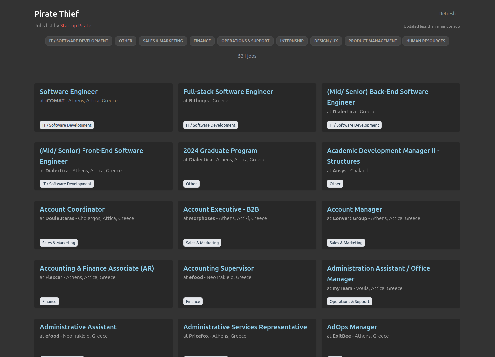

# Greek Tech Jobs Map

### Job listing app (source: [Startup Pirate](https://docs.google.com/spreadsheets/d/1s8XLKx-D23jEBM-LifstRFWX2Zj6Lv98twNxObHeXjQ/edit?gid=0#gid=0)).

Greek Tech Jobs Map is a small job listing app which "steals" the published job ads of the Startup Pirate (startuppirate.gr), and display them through an intuitive UI.

It could be characterized as a scraper which parses an online and public google spreadsheed, aggregates and showcase the list of job ads in an intuitive way.

### [Demo](https://gtopsis.github.io/pirate-thief/)

<br>



<br>

[](https://vuejs.org/)
[](https://www.typescriptlang.org/)
[](https://vite.dev/)
[](https://tailwindcss.com/)
[](https://vitest.dev/)

## Table of Contents

- [Features](#features)
- [Tech Stack](#tech-stack)
- [Getting Started](#getting-started)
  - [Prerequisites](#prerequisites)
  - [Installation](#installation)
  - [Environment Variables](#environment-variables)
- [Available Scripts](#available-scripts)
- [Deployment](#deployment)

## Features

- 🗺️ **Interactive map** of job locations across Greece, powered by Leaflet, with marker clustering and a density heatmap view.
- 🔍 **Search & filters** by title, company, location, and tech area, synced with the current map viewport.
- 📍 **Smart geocoding** that resolves free-text locations to map coordinates, with fuzzy matching for typos and remote-job handling.
- 📱 **Responsive UI** with a desktop sidebar and a draggable mobile bottom sheet.
- 🌗 **Light/dark mode** that follows the OS/browser preference.
- 🔗 **Shareable URLs** that persist the current map view and active filters.
- ♿ **Accessible** by design (keyboard shortcuts, ARIA live regions, WCAG-conscious interactions).

## Tech Stack

| Category           | Tools                                                                           |
| ------------------ | ------------------------------------------------------------------------------- |
| Framework          | [Vue 3](https://vuejs.org/) (Composition API, `<script setup>`)                 |
| Language           | [TypeScript](https://www.typescriptlang.org/)                                   |
| Build tool         | [Vite](https://vite.dev/)                                                       |
| Styling            | [Tailwind CSS 4](https://tailwindcss.com/)                                      |
| Map                | [Leaflet](https://leafletjs.com/) + marker clustering & heatmap plugins         |
| Testing            | [Vitest](https://vitest.dev/) + [Vue Test Utils](https://test-utils.vuejs.org/) |
| Linting/Formatting | [ESLint](https://eslint.org/) + [Prettier](https://prettier.io/)                |
| Package manager    | [pnpm](https://pnpm.io/)                                                        |

## Getting Started

### Prerequisites

- [Node.js](https://nodejs.org/) 24+
- [pnpm](https://pnpm.io/) 9+

### Installation

1. Clone the repository:

   ```sh
   git clone https://github.com/gtopsis/greek-tech-jobs-map.git
   cd greek-tech-jobs-map
   ```

2. Install dependencies:

   ```sh
   pnpm install
   ```

3. Configure your environment variables (see below).

4. Start the dev server:

   ```sh
   pnpm dev
   ```

### Environment Variables

Copy `.env.example` to `.env` and fill in your own [Google Sheets API](https://developers.google.com/sheets/api) credentials:

```sh
cp .env.example .env
```

| Variable                            | Description                                             |
| ----------------------------------- | ------------------------------------------------------- |
| `VITE_GOOGLE_SPREADSHEET_ID`        | The ID of the published Google Sheet to read jobs from. |
| `VITE_GOOGLE_SPREADSHEET_API_KEY`   | A Google Sheets API key with read access to the sheet.  |
| `VITE_GOOGLE_SPREADSHEET_API_RANGE` | The sheet/range to read (e.g. `Jobs`).                  |

## Available Scripts

| Command           | Description                                                |
| ----------------- | ---------------------------------------------------------- |
| `pnpm dev`        | Start the dev server with hot-reload.                      |
| `pnpm build`      | Type-check, compile, and minify for production.            |
| `pnpm preview`    | Preview the production build locally.                      |
| `pnpm test:unit`  | Run unit tests with [Vitest](https://vitest.dev/).         |
| `pnpm type-check` | Type-check the project with `vue-tsc`.                     |
| `pnpm lint`       | Lint (and auto-fix) with [ESLint](https://eslint.org/).    |
| `pnpm format`     | Format the codebase with [Prettier](https://prettier.io/). |

## Deployment

The app is automatically built and deployed to [GitHub Pages](https://pages.github.com/) on every push to `main` (see [`.github/workflows/main.yml`](.github/workflows/main.yml)).
